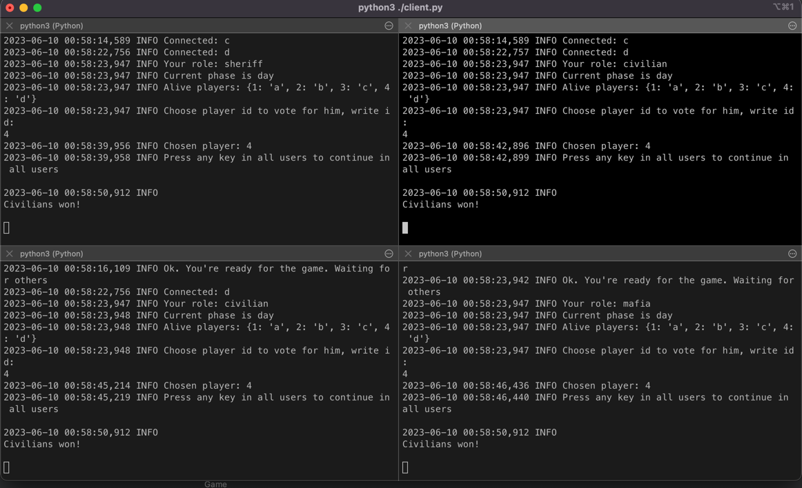
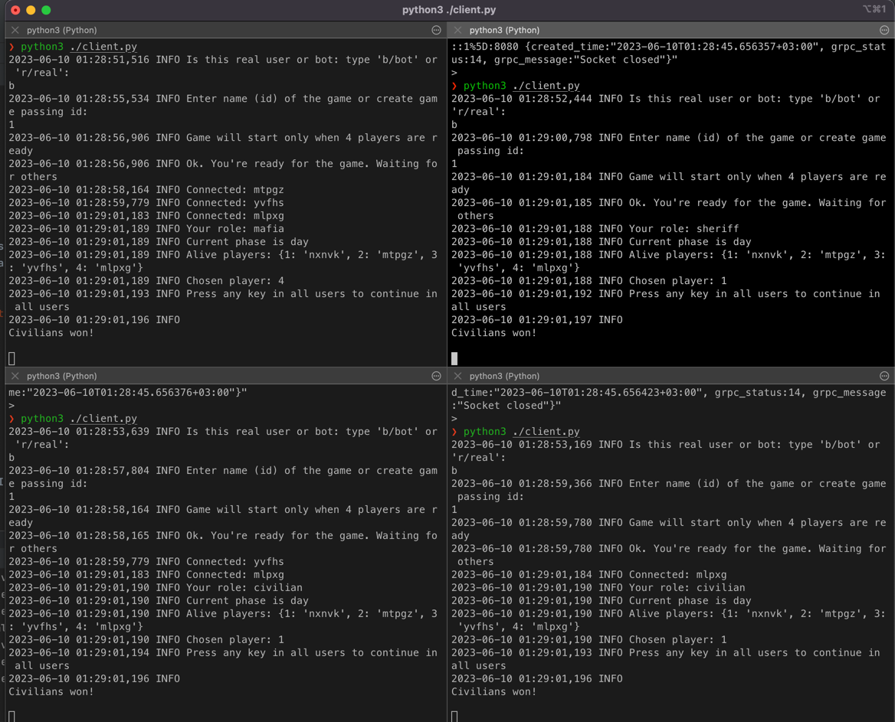

**SOA-hw/mafia**

В игре есть боты, для того, чтобы создать бота надо указать, что тип игрока 
бот (передавая b/bot) и выбрав сеанс игры куда он должен добавиться.

Если были изменения в коде сервера надо запушить образ:
```
docker build . -t starboy369/mafia_server && docker push starboy369/mafia_server 
```

Запустить сервер [надо иметь доступ к docker hub]:
```
docker-compose build && docker-compose up
```

Запустить клиента:
```
python3 -m pip install -r requirements.txt && python3 client.py
```

Пример игры:
Все игроки реальные. Убили мафию в первом раунде и выиграли 


Все игроки боты - убили мафию в первом раунде (голосуют рандомно)
